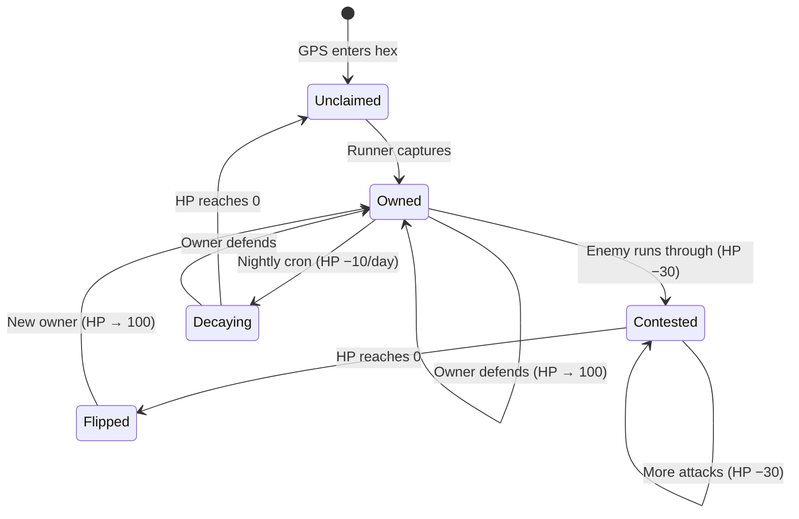

<p align="center">
  
  
  
  
  
</p>

# 🌐 RunSphere

**Gamified fitness tracking through hexagonal territory capture — powered by Uber's H3 geospatial indexing.**

RunSphere transforms running into a competitive territory capture game. The city of Dehradun is divided into hundreds of hexagonal cells using Uber's H3 spatial index, and players claim territories by physically running through them. Defend your turf, attack rivals, and watch idle territories decay — all rendered on a real-time, GPU-accelerated WebGL map.

---

## 📑 Table of Contents

- [Why H3?](#-the-uber-h3-model--why-hexagons-matter)
- [How H3 Powers RunSphere](#-how-h3-powers-runsphere)
- [Features](#-features)
- [Architecture](#-architecture)
- [Tech Stack](#-tech-stack)
- [Project Structure](#-project-structure)
- [Getting Started](#-getting-started)
- [API Overview](#-api-overview)
- [Documentation](#-documentation)

---

## 🔬 The Uber H3 Model — Why Hexagons Matter

At the core of RunSphere is [**Uber's H3**](https://h3geo.org/) — an open-source **Hexagonal Hierarchical Spatial Index** that divides the Earth's surface into a grid of hexagonal cells across 16 resolutions (0–15).

### Why hexagons over squares?

```
  Square Grid                 Hexagonal Grid
┌───┬───┬───┐               ╱╲   ╱╲   ╱╲
│   │   │   │              ╱  ╲ ╱  ╲ ╱  ╲
├───┼───┼───┤             │    │    │    │
│   │ X │   │              ╲  ╱ ╲  ╱ ╲  ╱
├───┼───┼───┤               ╲╱   ╲╱   ╲╱
│   │   │   │              ╱  ╲ ╱ X╲ ╱  ╲
└───┴───┴───┘             │    │    │    │
                           ╲  ╱ ╲  ╱ ╲  ╱
4 neighbors at distance d    ╲╱   ╲╱   ╲╱
4 neighbors at distance d√2  6 neighbors, ALL at
(unequal distances!)          the SAME distance ✅
```

| Property | Square Grid | Hexagonal Grid |
|----------|-------------|----------------|
| **Neighbor Count** | 4 edge + 4 corner = 8 | 6 edge neighbors |
| **Neighbor Distance** | Two different distances (`d` and `d√2`) | All neighbors equidistant |
| **Shape Coverage** | Aliasing artifacts on curves | Approximates circles naturally |
| **Visual Appeal** | Grid-like, artificial | Organic, game-friendly |

> **For territory mechanics, uniform neighbor distance is critical.** When a runner attacks an adjacent territory, the physical effort to reach any neighboring hex should be equal. Hexagons guarantee this; squares do not.

### H3 Resolution 9 — The Sweet Spot

RunSphere uses **Resolution 9**, chosen after evaluating the balance between granularity and performance:

| Resolution | Edge Length | Area | Verdict |
|-----------|-------------|------|---------|
| 7 | ~1.2 km | ~5.2 km² | ❌ Too large — covers a suburb |
| 8 | ~460 m | ~0.74 km² | ⚠️ One hex ≈ 4 city blocks |
| **9** | **~174 m** | **~0.105 km²** | **✅ ~2 city blocks, perfect for a single run** |
| 10 | ~66 m | ~0.015 km² | ⚠️ Too many hexes, performance issues |
| 11 | ~25 m | ~0.002 km² | ❌ Covers a single building |

> A typical **3 km run** through Dehradun captures approximately **10–15 hexagons** — rewarding without being trivial.

### Key H3 Advantages for RunSphere

| Feature | Benefit |
|---------|---------|
| **Deterministic indexing** | Same GPS coordinate always maps to the same hex — `latLngToCell(30.3165, 78.0322, 9)` → `"892a6c42b4bffff"` |
| **Global coverage** | H3 covers the entire Earth. No architecture changes needed to expand beyond Dehradun |
| **Boundary generation** | `cellToBoundary()` converts an H3 index back to polygon vertices for map rendering — no external geometry DB |
| **Compact storage** | Territories stored as a 15-char H3 string instead of full polygon arrays |
| **Hierarchical** | Resolution can be tuned (0–15) without changing the data model |

---

## ⚡ How H3 Powers RunSphere

### The GPS → Territory Pipeline

```
User finishes a run
        │
        ▼
Route coordinates: [[78.03, 30.31], [78.03, 30.32], ...]
        │
        ▼
  ┌─────────────────┐
  │   H3 Conversion │   latLngToCell(lat, lng, 9)
  │   (per point)    │   → "892a6c42b4bffff"
  └────────┬────────┘
           │
           ▼
  Deduplicate → 200 GPS points become ~12 unique H3 indexes
           │
           ▼
  ┌─────────────────────────────────┐
  │  For each unique H3 index:      │
  │                                 │
  │  Unclaimed?  → CAPTURE (100 HP) │
  │  Your hex?   → DEFEND (→ 100 HP)│
  │  Enemy hex?  → ATTACK (HP −30)  │
  │  HP ≤ 0?     → FLIP ownership   │
  └────────┬────────────────────────┘
           │
           ▼
  cellToBoundary(h3Index) → GeoJSON Polygon
           │
           ▼
  Stored in MongoDB (h3Index, ownerId, health, geometry)
           │
           ▼
  Rendered on MapLibre GL map with data-driven styling
```

### Territory Lifecycle



---

## ✨ Features

### 🗺️ Territory Warfare Map
- Full-screen dark-themed map powered by **MapLibre GL** with **CARTO Dark Matter** basemap
- GPU-accelerated WebGL rendering handles 2,000+ hexagons at 60fps
- Color-coded territories: 🟠 yours • 🔵 enemy • ⚪ neutral
- Health-based opacity — decaying territories literally fade from the map
- Interactive hover tooltips with owner, health %, and status
- Auto-refreshes every 30 seconds via TanStack React Query polling

### 🏃 Live Run Tracking
- Real-time GPS tracking via `navigator.geolocation.watchPosition()`
- Desktop simulation fallback with realistic walking/jogging speed (~6–10 km/h)
- Haversine formula for accurate distance computation
- Live pace calculation (min:sec per km)
- State machine: `IDLE → RUNNING → PAUSED → SAVING`

### ⚔️ Capture & Contest Mechanics
- Auto-capture on run save — every hex your route passes through is processed
- Attack enemy hexes: **−30 HP per pass** (takes ~4 runs to steal)
- Defend your hexes: health restored to 100 on re-run
- Nightly decay: **−10 HP/day** via cron job. Undefended territory goes neutral in 10 days

### 📊 Dashboard & Gamification
- Personalized stats: streak 🔥, total distance, territories owned
- Global leaderboard with podium (gold/silver/bronze)
- Daily challenges with progress bars
- Run history with timeline view and deletion support
- Streak tracking with consecutive-day detection

---

## 🏗 Architecture

```
┌──────────────────────────────────────────────────────┐
│                     FRONTEND                          │
│  Next.js 16 · React 19 · TanStack Query · MapLibre   │
│                                                       │
│  ┌──────────┐  ┌──────────┐  ┌───────────────────┐   │
│  │ Dashboard │  │Run Track │  │  Territory Map     │   │
│  │ Stats     │  │GPS + Sim │  │  MapLibre GL +     │   │
│  │ Streaks   │  │Haversine │  │  GeoJSON Layers    │   │
│  └────┬─────┘  └────┬─────┘  └────────┬──────────┘   │
│       └──────────────┼─────────────────┘              │
│                      │ Axios + JWT                    │
└──────────────────────┼────────────────────────────────┘
                       │ REST API (HTTP/JSON)
┌──────────────────────┼────────────────────────────────┐
│                      │        BACKEND                 │
│  Node.js · Express 5 · JWT Auth · H3-js · node-cron   │
│                      │                                │
│  ┌───────────────────▼──────────────────────────┐     │
│  │              API Routes                       │     │
│  │  /users  /runs  /territories  /leaderboard    │     │
│  └───────────────────┬──────────────────────────┘     │
│                      │                                │
│  ┌──────────┐  ┌─────▼──────┐  ┌──────────────┐      │
│  │ Streak   │  │ Capture    │  │ Decay Job    │      │
│  │ Service  │  │ Service    │  │ (node-cron)  │      │
│  │          │  │ GPS→H3→DB  │  │ −10 HP/night │      │
│  └──────────┘  └─────┬──────┘  └──────────────┘      │
│                      │                                │
│              ┌───────▼───────┐                        │
│              │   H3 Utils    │                        │
│              │ latLngToCell  │                        │
│              │cellToBoundary │                        │
│              └───────┬───────┘                        │
└──────────────────────┼────────────────────────────────┘
                       │
              ┌────────▼────────┐
              │   MongoDB Atlas  │
              │   4 Collections  │
              │  Users · Runs    │
              │  Territories     │
              │  Challenges      │
              │  (2dsphere idx)  │
              └─────────────────┘
```

---

## 🛠 Tech Stack

| Layer | Technology | Purpose |
|-------|-----------|---------|
| **Frontend** | Next.js 16, React 19 | App Router, SSR, client components |
| **State Management** | TanStack React Query v5 | Caching, polling (30s), parallel fetching |
| **Map Engine** | MapLibre GL JS + react-map-gl v8 | WebGL map rendering with declarative React components |
| **Basemap** | CARTO Dark Matter | Free, dark-themed vector tiles (no API key) |
| **Hex Grid** | Uber H3 (`h3-js` v4) at Resolution 9 | GPS → hexagonal cell conversion & boundary generation |
| **Backend** | Node.js, Express 5 | REST API server |
| **Database** | MongoDB Atlas + Mongoose | Document storage with `2dsphere` geospatial indexes |
| **Auth** | JWT + bcryptjs | Stateless authentication (30-day tokens) |
| **Scheduling** | node-cron | Nightly territory health decay |
| **Styling** | Vanilla CSS | Custom design tokens, glassmorphism, animations |
| **Icons** | lucide-react | Consistent iconography |

---

## 📁 Project Structure

```
RunSphere/
├── backend/
│   └── src/
│       ├── index.js                 # Express app entry point
│       ├── config/db.js             # MongoDB connection
│       ├── middleware/auth.js        # JWT verification
│       ├── models/
│       │   ├── User.js              # username, streak, distance, territories
│       │   ├── Run.js               # GeoJSON LineString routes
│       │   ├── Territory.js         # h3Index, ownerId, health, GeoJSON Polygon
│       │   └── Challenge.js         # Daily challenges
│       ├── routes/
│       │   ├── user.js              # Register / Login / Profile
│       │   ├── run.js               # CRUD runs + auto-capture trigger
│       │   ├── territory.js         # Territory GeoJSON API
│       │   ├── leaderboard.js       # Ranked aggregation
│       │   └── challenge.js         # Active challenges
│       ├── services/
│       │   ├── captureService.js     # H3 capture + contest logic
│       │   └── streakService.js      # Consecutive-day tracking
│       ├── jobs/
│       │   └── decayJob.js           # Cron: −10 HP/night
│       ├── utils/
│       │   └── h3Utils.js            # getH3Index() + getHexagonBoundary()
│       └── scripts/
│           └── seed.js               # Challenge seeding
│
├── frontend/
│   └── src/
│       ├── app/
│       │   ├── layout.jsx            # Root layout
│       │   ├── globals.css           # Design system
│       │   ├── page.jsx              # Landing page
│       │   ├── login/page.jsx        # Login form
│       │   ├── signup/page.jsx       # Registration form
│       │   └── dashboard/
│       │       ├── layout.jsx        # Dashboard shell + sidebar
│       │       ├── page.jsx          # Stats overview
│       │       ├── run/page.jsx      # Live run tracker
│       │       ├── runs/page.jsx     # Run history timeline
│       │       ├── map/page.jsx      # Territory map
│       │       ├── planner/page.jsx  # Fitness goal calculator
│       │       └── leaderboard/page.jsx
│       ├── components/
│       │   ├── Sidebar.jsx           # Navigation sidebar
│       │   ├── MapView.jsx           # MapLibre GL territory renderer
│       │   ├── StatCard.jsx          # Animated stat cards
│       │   ├── ActivityFeed.jsx      # Recent runs + deletion
│       │   └── DailyChallenges.jsx   # Challenge progress cards
│       ├── lib/
│       │   ├── api.js                # Axios instance + JWT interceptor
│       │   └── auth.js               # Token/user localStorage helpers
│       └── providers/
│           └── QueryProvider.jsx     # TanStack Query context
│
└── docs/                             # Project documentation
```

---

## 🚀 Getting Started

### Prerequisites

- **Node.js** ≥ 18
- **MongoDB Atlas** cluster (or local MongoDB instance)
- **npm** or **yarn**

### 1. Clone the repository

```bash
git clone https://github.com/shishirdhasmana/RunSphere.git
cd RunSphere
```

### 2. Backend setup

```bash
cd backend
npm install
```

Create a `.env` file:

```env
MONGODB_URI=mongodb+srv://<user>:<password>@cluster.mongodb.net/runsphere
JWT_SECRET=your-secret-key
PORT=5000
```

Seed the database with challenges:

```bash
npm run seed
```

Start the backend:

```bash
npm run dev
```

### 3. Frontend setup

```bash
cd frontend
npm install
npm run dev
```

The app will be running at `http://localhost:3000`.

---

## 📡 API Overview

| Method | Endpoint | Description |
|--------|----------|-------------|
| `POST` | `/api/users/register` | Create a new account |
| `POST` | `/api/users/login` | Authenticate and receive JWT |
| `GET` | `/api/users/profile` | Get authenticated user's profile |
| `POST` | `/api/runs` | Save a run + auto-capture territories |
| `GET` | `/api/runs` | Get user's run history |
| `DELETE` | `/api/runs/:id` | Delete a run |
| `GET` | `/api/territories` | Get all territories as GeoJSON FeatureCollection |
| `GET` | `/api/leaderboard` | Get ranked user list |
| `GET` | `/api/challenges` | Get active daily challenges |

---

## 📚 Documentation

Detailed documentation is available in the [`docs/`](docs/) directory:

| Document | Description |
|----------|-------------|
| [H3 & Run Simulation](docs/RunSphere_H3_and_RunSimulation_Documentation.md) | Deep dive into H3 indexing, capture logic, and GPS simulation |
| [Map Integration](docs/RunSphere_Map_Integration.md) | MapLibre GL architecture, data-driven styling, and technology choices |
| [API Documentation](docs/RunSphere_API_Documentation.md) | Complete API reference with request/response examples |
| [Project Functionalities](docs/PROJECT_FUNCTIONALITIES.md) | Feature-by-feature guide with implementation details |
| [Workflow](docs/RunSphere_Workflow.md) | Development workflow and project lifecycle |
| [Deployment Guide](docs/RunSphere_Deployment_Guide.md) | Production deployment instructions |

---

## 🎯 Game Mechanics at a Glance

| Mechanic | Rule |
|----------|------|
| **Capture** | Run through an unclaimed hex → it's yours (100 HP) |
| **Defend** | Run through your own hex → health restored to 100 |
| **Attack** | Run through an enemy hex → their HP −30 |
| **Flip** | Enemy HP hits 0 → you take ownership |
| **Decay** | −10 HP per night for all owned territories |
| **Neutral** | A territory that decays to 0 HP becomes unclaimed |

---

<p align="center">
  <b>Built with 🏃 sweat and ⬡ hexagons</b><br>
  <sub>Powered by Uber H3 · MapLibre GL · MERN Stack</sub>
</p>
